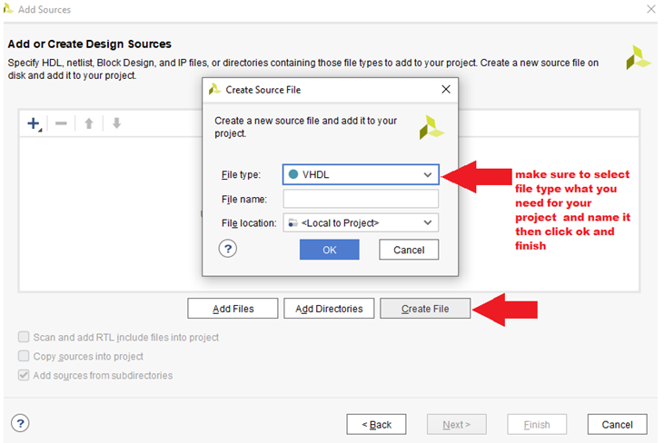

# Task 2

## Listing of VHDL architecture

```vhdl

architecture Behavioral of mux_2bit_4to1 is
begin
    f_o <= a_i when (sel_i = "00") else 
           b_i when (sel_i = "01") else 
           c_i when (sel_i = "10") else 
           d_i;

   


end architecture Behavioral;
```
## Listing of VHDL stimulus process

```vhdl
    p_stimulus : process
    begin
        -- Report a note at the begining of stimulus process
        report "Stimulus process started" severity note;


        -- First test values
       s_d <= "00"; s_c <= "00"; s_b <= "01"; s_a <= "01"; 
       s_sel <= "00"; wait for 100ns;
       
        s_d <= "00"; s_c <= "00"; s_b <= "00"; s_a <= "01"; 
       s_sel <= "01"; wait for 100ns;
       
        s_d <= "00"; s_c <= "01"; s_b <= "00"; s_a <= "00"; 
       s_sel <= "10"; wait for 100ns;
       
       s_d <= "00"; s_c <= "00"; s_b <= "00"; s_a <= "00"; 
       s_sel <= "11"; wait for 100ns;
           
    
      


        -- Report a note at the end of stimulus process
        report "Stimulus process finished" severity note;
        wait;
    end process p_stimulus;

end architecture testbench;
```

 


# Task 3
## Vivado tutorial

 

### If you want to add any source files right away,
### go and use the instructions in adding source file 
### otherwise press next until you get here. 
### If you want to use specific parts or board select it here or in section parts. 
### I am going to use NexysA7-50T for this project. 
### Also if you cant find the board you are looking for try to Install/Update Boards 
### via. The button in the upper right corner. 


### Then go next and finish  

### Adding source file:

 

 

 

 

### adding testbench file:

 

 

### Then open/edit the testbench file same way as the design file.


### Adding XDC constraints file :

 

 

### The file with your board should be here [digilent library](https://github.com/Digilent/digilent-xdc). 
### Just find your board fit Ctrl+F and copy what’s imide into your opened folder  (.xdc) in Vivado.

### Simulation :

  
