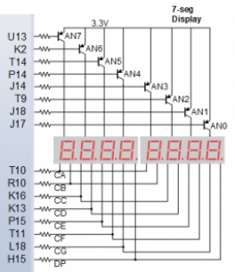
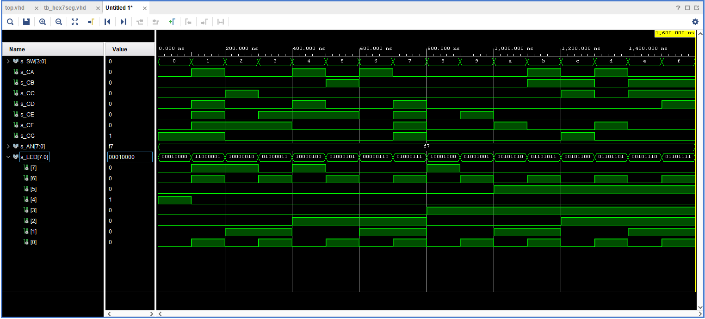

odkaz na repositar [DE1](https://github.com/MartinSomsak00/DE1) 

# Task 1

## 7-segment displays on Nexys A7 board

 

## Decoder truth table for common anode 7-segment display.

 **Hex** | **Inputs** | **A** | **B** | **C** | **D** | **E** | **F** | **G** |
| :-: | :-: | :-: | :-: | :-: | :-: | :-: | :-: | :-: |
| 0 | 0000 | 0 | 0 | 0 | 0 | 0 | 0 | 1 |
| 1 | 0001 | 1 | 0 | 0 | 1 | 1 | 1 | 1 |
| 2 | 0010 | 0 | 0 | 1 | 0 | 0 | 1 | 0 |
| 3 | 0011 | 0 | 0 | 0 | 0 | 1 | 1 | 0 |
| 4 | 0100 | 1 | 0 | 0 | 1 | 1 | 0 | 0 |
| 5 | 0101 | 0 | 1 | 0 | 0 | 1 | 0 | 0 |
| 6 | 0110 | 0 | 1 | 0 | 0 | 0 | 0 | 0 |
| 7 | 0111 | 0 | 0 | 0 | 1 | 1 | 1 | 1 |
| 8 | 1000 | 0 | 0 | 0 | 0 | 0 | 0 | 0 |
| 9 | 1001 | 0 | 0 | 0 | 0 | 1 | 0 | 0 |
| A | 1010 | 0 | 0 | 0 | 0 | 0 | 1 | 0 |
| b | 1011 | 1 | 1 | 0 | 0 | 0 | 0 | 0 |
| C | 1100 | 0 | 1 | 1 | 0 | 0 | 0 | 1 |
| d | 1101 | 1 | 0 | 0 | 0 | 0 | 1 | 0 |
| E | 1110 | 0 | 1 | 1 | 0 | 0 | 0 | 0 |
| F | 1111 | 0 | 1 | 1 | 1 | 0 | 0 | 0 |

# Task 2

## Listing of VHDL architecture 
 
```vhdl
p_7seg_decoder : process(hex_i)
    begin
        case hex_i is
            when "0000" =>
                seg_o <= "0000001";     -- 0
            when "0001" =>
                seg_o <= "1001111";     -- 1
            when "0010" =>
                seg_o <= "0010010";     --2
            when "0011" =>
                seg_o <= "0000110";     --3 
             when "0100" =>
                seg_o <= "1001100";     -- 4
            when "0101" =>
                seg_o <= "0100100";     -- 5
            when "0110" =>
                seg_o <= "1000000";     --6
            when "0111" =>
                seg_o <= "0001111";     --7     
             when "1000" =>
                seg_o <= "0000000";     -- 8
            when "1001" =>
                seg_o <= "0000100";     --9
            when "1010" =>
                seg_o <= "0000010";     --A
            when "1011" =>
                seg_o <= "1100000";      --B
            when "1100" => 
                seg_o <= "0110001";      --C
            when "1101" =>
               seg_o <= "1000010";      --D
           
    
            when "1110" =>
                seg_o <= "0110000";     -- E
            when others =>
                seg_o <= "0111000";     -- F
        end case;
    end process p_7seg_decoder;

```

## Listing of VHDL stimulus process

```vhdl
p_stimulus : process
    begin
        -- Report a note at the begining of stimulus process
        report "Stimulus process started" severity note;
        
        s_hex <= "0000"; wait for 100ns;
        s_hex <= "0001"; wait for 100ns;
        s_hex <= "0010"; wait for 100ns;
        s_hex <= "0011"; wait for 100ns;
        s_hex <= "0100"; wait for 100ns;
        s_hex <= "0101"; wait for 100ns;
        s_hex <= "0110"; wait for 100ns;
        s_hex <= "0111"; wait for 100ns;
        s_hex <= "1000"; wait for 100ns;
        s_hex <= "1001"; wait for 100ns;
        s_hex <= "1010"; wait for 100ns;
        s_hex <= "1011"; wait for 100ns;
        s_hex <= "1100"; wait for 100ns;
        s_hex <= "1101"; wait for 100ns;
        s_hex <= "1110"; wait for 100ns;
        s_hex <= "1111"; wait for 100ns;
 
 
       end process p_stimulus;
```

## Screenshot with simulated time waveforms


## Listing of VHDL code with 7-segment module instantiation


```vhdl
 begin  
    hex2seg : entity work.hex_7seg
        port map(
           hex_i   => SW,
           seg_o(6)   => CA,
           seg_o(5)   => CB,
           seg_o(4)   => CC,
           seg_o(3)   => CD,
           seg_o(2)   => CE,
           seg_o(1)   => CF,
           seg_o(0)   => CG
        );
```


# Task 3

| **Hex** | **In** | **LED4** | **LED5** | **LED6** | **LED7** |
| :-: | :-: | :-: | :-: | :-: | :-: |
| 0 | 0000 | 1 | 0 | 0 | 0 |
| 1 | 0001 | 0 | 0 | 1 | 1 |
| 2 | 0010 | 0 | 0 | 0 | 1 |
| 3 | 0011 | 0 | 0 | 1 | 0 |
| 4 | 0100 | 0 | 0 | 0 | 1 |
| 5 | 0101 | 0 | 0 | 1 | 0 |
| 6 | 0110 | 0 | 0 | 0 | 0 |
| 7 | 0111 | 0 | 0 | 1 | 0 |
| 8 | 1000 | 0 | 0 | 0 | 1 |
| 9 | 1001 | 0 | 0 | 1 | 0 |
| A | 1010 | 0 | 1 | 0 | 0 |
| B | 1011 | 0 | 1 | 1 | 0 |
| C | 1100 | 0 | 1 | 0 | 0 |
| D | 1101 | 0 | 1 | 1 | 0 |
| E | 1110 | 0 | 1 | 0 | 0 |
| F | 1111 | 0 | 1 | 1 | 0 |

```vhdl
 LED(4) <= '1' when (SW = "0000") else '0';
        
        LED(5) <= '1' when (SW = "1010") else '0',
              '1' when (SW = "1011") else '0',
              '1' when (SW = "1100") else '0',
              '1' when (SW = "1101") else '0',
              '1' when (SW = "1110") else '0',
              '1' when (SW = "1111") else '0';
              
        LED(6) <= '1' when (SW = "0001") else '0',
              '1' when (SW = "0011") else '0',
              '1' when (SW = "0101") else '0',
              '1' when (SW = "0111") else '0',
              '1' when (SW = "1001") else '0',
              '1' when (SW = "1011") else '0',
              '1' when (SW = "1101") else '0',
              '1' when (SW = "1111") else '0';
           
        LED(7) <= '1' when (SW = "0001") else '0',
              '1' when (SW = "0010") else '0',
              '1' when (SW = "0100") else '0',
              '1' when (SW = "1000") else '0';
                
end architecture Behavioral;
```

## Screenshot with simulated time waveforms

