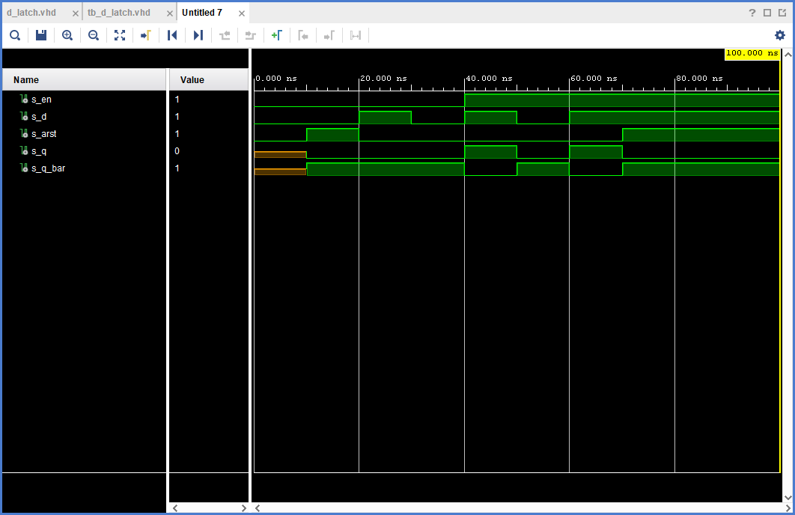

odkaz na repositar [DE1](https://github.com/MartinSomsak00/DE1) 

# Task 1


# Task 2

## VHDL code listing of the process p_d_latch :

```vhdl
p_d_latch : process(en, d, arst)
    begin
        if (arst = '1') then
            q       <= '0';
            q_bar   <= '1';
        elsif (en = '1') then
            q       <= d;
            q_bar   <= not d;
        end if;
    end process p_d_latch;
```

## Listing of VHDL reset and stimulus processes from the testbench tb_d_latch.vhd :

```vhdl
p_reset_gen :process
    begin
    s_arst  <=  '0';
    wait for 10 ns; 
    
    s_arst  <=  '1';
    wait for 10 ns; 
    
    s_arst  <=  '0';
    wait for 50 ns; 
    
      s_arst  <=  '1';
      wait;
    
    
    end process p_reset_gen;
    
    
    p_stimulus : process
    begin
        -- Report a note at the begining of stimulus process
        report "Stimulus process started. " severity note;
        
        s_en    <=  '0';
        
        s_d     <=  '0'; 
        wait for 10 ns; 
        
        wait for 10 ns;
        
        
        
        s_d     <=  '1';
        wait for 10ns;
        assert (s_q = '0' and s_q_bar = '1') 
        report "Failed 1" severity note;
        
        s_d     <=  '0';
        wait for 10ns;
        assert (s_q = '0' and s_q_bar = '1') 
        report "Failed 2" severity note;
        
        
        s_en    <=  '1';
        s_d     <=  '1';
        wait for 10ns;
        assert (s_q = '1' and s_q_bar = '0') 
        report "Failed 3" severity note;
       
        s_en    <=  '1';
        s_d     <=  '0';
        wait for 10ns;
        assert (s_q = '0' and s_q_bar = '1')
        report "Failed 4" severity note;
        
        
        s_en    <=  '1';
        s_d     <=  '1';
        wait for 10ns;
        
        assert (s_q = '0' and s_q_bar = '1') 
        report "Failed 5" severity note;
        
        report "Stimulus process end." severity note;
        wait;
    end process p_stimulus;
```

## Screenshot with simulated time waveforms :




# Task 3
