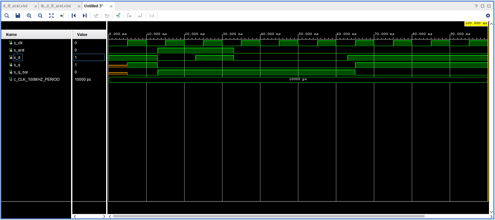
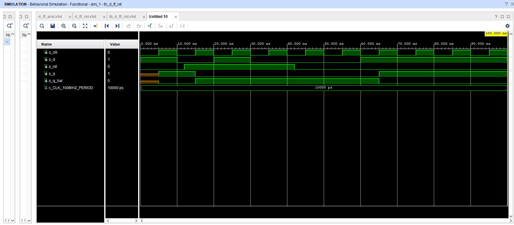
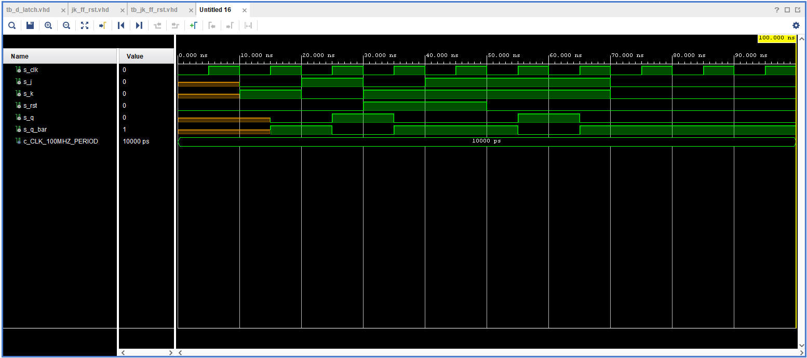
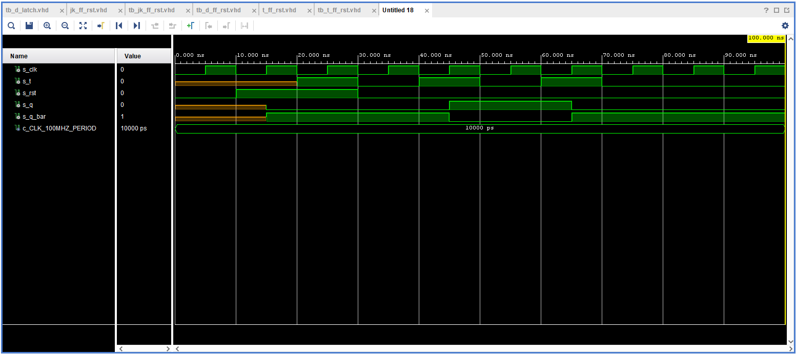

odkaz na repositar [DE1](https://github.com/MartinSomsak00/DE1) 

# Task 1


## Characteristic equations and completed tables for D, JK, T flip-flops : 

   ```verilog
   D flip flop: q_(n+1) = d
   JK flip flop: q_(n+1) = j * (not q_n) + (not k) * q_n
   T flip flop: q_(n+1) = t * (not q_n) + (not t) * q_n
   ```

   | **D** | **Qn** | **Q(n+1)** | **Comments** |
   | :-: | :-: | :-: | :-- |
   | 0 | 0 | 0 | No change |
   | 0 | 1 | 0 | Change |
   | 1 | 1 | 1 | No change |
   | 1 | 0 | 1 | Change |

   | **J** | **K** | **Qn** | **Q(n+1)** | **Comments** |
   | :-: | :-: | :-: | :-: | :-- |
   | 0 | 0 | 0 | 0 | No change |
   | 0 | 0 | 1 | 1 | No change |
   | 0 | 1 | 0 | 0 | Reset |
   | 0 | 1 | 1 | 0 | Reset |
   | 1 | 0 | 0 | 1 | Set |
   | 1 | 0 | 1 | 1 | Set |
   | 1 | 1 | 0 | 1 | Toggle |
   | 1 | 1 | 1 | 0 | Toggle |

   | **T** | **Qn** | **Q(n+1)** | **Comments** |
   | :-: | :-: | :-: | :-- |
   | 0 | 0 | 0 | No change |
   | 0 | 1 | 1 | No change |
   | 1 | 0 | 1 | Toggle |
   | 1 | 1 | 0 | Toggle |


# Task 2

## VHDL code listing of the process p_d_latch :

```vhdl
p_d_latch : process(en, d, arst)
    begin
        if (arst = '1') then
            q       <= '0';
            q_bar   <= '1';
        elsif (en = '1') then
            q       <= d;
            q_bar   <= not d;
        end if;
    end process p_d_latch;
```

## Listing of VHDL reset and stimulus processes from the testbench tb_d_latch.vhd :

```vhdl
p_reset_gen :process
    begin
    s_arst  <=  '0';
    wait for 10 ns; 
    
    s_arst  <=  '1';
    wait for 10 ns; 
    
    s_arst  <=  '0';
    wait for 50 ns; 
    
      s_arst  <=  '1';
      wait;
    
    
    end process p_reset_gen;
    
    
    p_stimulus : process
    begin
        -- Report a note at the begining of stimulus process
        report "Stimulus process started. " severity note;
        
        s_en    <=  '0';
        
        s_d     <=  '0'; 
        wait for 10 ns; 
        
        wait for 10 ns;
        
        
        
        s_d     <=  '1';
        wait for 10ns;
        assert (s_q = '0' and s_q_bar = '1') 
        report "Failed 1" severity note;
        
        s_d     <=  '0';
        wait for 10ns;
        assert (s_q = '0' and s_q_bar = '1') 
        report "Failed 2" severity note;
        
        
        s_en    <=  '1';
        s_d     <=  '1';
        wait for 10ns;
        assert (s_q = '1' and s_q_bar = '0') 
        report "Failed 3" severity note;
       
        s_en    <=  '1';
        s_d     <=  '0';
        wait for 10ns;
        assert (s_q = '0' and s_q_bar = '1')
        report "Failed 4" severity note;
        
        
        s_en    <=  '1';
        s_d     <=  '1';
        wait for 10ns;
        
        assert (s_q = '0' and s_q_bar = '1') 
        report "Failed 5" severity note;
        
        report "Stimulus process end." severity note;
        wait;
    end process p_stimulus;
```

## Screenshot with simulated time waveforms :


# Task 3

## p_d_ff_arst

```vhdl
p_d_ff_arst : process(clk, arst)
    begin
        if (arst = '1') then
            q       <= '0';
            q_bar   <= '1';
        elsif rising_edge(clk) then
            q       <= d;
            q_bar   <= not d;
        end if;
    end process p_d_ff_arst;
```

##  testbench 

```vhdl

 p_clk_gen : process
    begin
        while now < 750 ns loop        
            s_clk <= '0';
            wait for c_CLK_100MHZ_PERIOD / 2;
            s_clk <= '1';
            wait for c_CLK_100MHZ_PERIOD / 2;
        end loop;
        wait;
    end process p_clk_gen;
	
  p_reset_gen : process
    begin
        s_arst <= '0';
        wait for 13 ns;
        s_arst <= '1';                 -- Reset activated
        wait for 20 ns;
        s_arst <= '0';
        wait;
    end process p_reset_gen;

    p_stimulus : process
    begin
        -- Report a note at the begining of stimulus process
        report "Stimulus process started." severity note;
        s_d     <=  '1';
        wait for 10ns;
        assert (s_q = '0' and s_q_bar = '1') 
        report "Failed 1" severity note;
        
        s_d     <=  '0';
        wait for 10ns;
        assert (s_q = '0' and s_q_bar = '1') 
        report "Failed 2" severity note;
        
        s_d     <=  '1';
        wait for 10ns;
        assert (s_q = '1' and s_q_bar = '0') 
        report "Failed 3" severity note;
       
        s_d     <=  '0';
        wait for 10ns;
        assert (s_q = '0' and s_q_bar = '1') 
        report "Failed 4" severity note;
        
        wait for 20ns;
        s_d     <=  '1';
        wait for 10ns;
        assert (s_q = '0' and s_q_bar = '1') 
        report "Failed 5" severity note;
        
        report "Stimulus process ended. " severity note;
        wait;
    end process p_stimulus;
```

## Screenshot with simulated time waveforms :



## p_d_ff_rst

```vhdl
 p_d_ff_arst : process(clk)
    begin        
        if rising_edge(clk) then
        if (rst = '1') then
         q       <= '0';
         q_bar   <= '1';
        else
         q       <= d;
         q_bar   <= not d;
        end if;
        end if;
    end process p_d_ff_arst;

```

## testbench 

```vhdl
  p_reset_gen : process
    begin
        s_rst <= '0';
        wait for 12 ns;
        s_rst <= '1';                 -- Reset activated
        wait for 30 ns;
        s_rst <= '0';
        wait;
    end process p_reset_gen;

    p_stimulus : process
    begin
        -- Report a note at the begining of stimulus process
        report "Stimulus process started. " severity note;
        s_d     <=  '1';
        wait for 10ns;
        assert (s_q = '1' and s_q_bar = '0') 
        report "Failed 1" severity note;
        
        s_d     <=  '0';
        wait for 10ns;
        assert (s_q = '0' and s_q_bar = '1') 
        report "Failed 2" severity note;
        
        s_d     <=  '1';
        wait for 10ns;
        assert (s_q = '0' and s_q_bar = '1') 
        report "Failed 3" severity note;
       
        s_d     <=  '0';
        wait for 10ns;
        assert (s_q = '0' and s_q_bar = '1') 
        report "Failed 4" severity note;
        
        wait for 20ns;
        s_d     <=  '1';
        wait for 25ns;
        assert (s_q = '1' and s_q_bar = '0') 
        report "Failed 5" severity note;
        
        report "Stimulus process ended. " severity note;
        wait;
    end process p_stimulus;
```



## p_jk_ff_rst

```vhdl
jk_ff_rst : process(clk)
    begin
        if rising_edge(clk) then
            if (rst = '1') then
                s_q         <=  '0';
                s_q_bar     <=  '1'; 
             else
                if (j = '0' and k = '0') then 
                    s_q     <=  s_q;
                    s_q_bar <=  s_q_bar;
                elsif (j = '0' and k = '1') then 
                    s_q     <=  '0';
                    s_q_bar <=  '1';
                elsif (j = '1' and k = '0') then 
                    s_q     <=  '1';
                    s_q_bar <=  '0';
                else 
                    s_q     <=  not s_q;
                    s_q_bar <=  not s_q_bar;
                end if;
             end if;
        end if;
    end process jk_ff_rst
```

## testbench :

```vhdl
p_reset_gen : process
    begin
        s_rst   <= '0';
        wait for 30 ns;
        s_rst   <= '1';                 -- Reset activated
        wait for 20 ns;
        s_rst   <= '0';
        wait;
    end process p_reset_gen;

    p_stimulus : process
    begin
        -- Report a note at the begining of stimulus process
        report "Stimulus process started. " severity note;
        
 
      
        wait for 10ns;
        assert (s_q = '1' and s_q_bar = '0') report "Failed 1" severity note;
        

        s_j <=  '0';
        s_k <=  '1';
        wait for 10ns;
        assert (s_q = '0' and s_q_bar = '1') report "Failed 2" severity note;

        s_j <=  '1';
        s_k <=  '0';
        wait for 10ns;
        assert (s_q = '1' and s_q_bar = '0') report "Failed 3" severity note;
        

        s_j <=  '0';
        s_k <=  '1';    
        wait for 10ns;
        assert (s_q = '0' and s_q_bar = '1') report "Failed 4" severity note;
        

        s_j <=  '1';
        s_k <=  '1';
        wait for 10ns;
        assert (s_q = '1' and s_q_bar = '0') report "Failed 5" severity note;
        
      
        s_j <=  '1';
        s_k <=  '1';
        wait for 10ns;
        assert (s_q = '0' and s_q_bar = '1') report "Failed 6" severity note;
        
     
        s_j <=  '1';
        s_k <=  '1';
        wait for 10ns;        
        assert (s_q = '1' and s_q_bar = '0') report "Failed 7" severity note;
        
       
        s_j <=  '0';
        s_k <=  '0';
        wait for 10ns;
        assert (s_q = '1' and s_q_bar = '0') report "Failed 8" severity note;
        
        report "Stimulus process ended. " severity note;
        wait;
    end process p_stimulus;
```



## p_t_ff_rst

```vhdl
t_ff_rst : process(clk)
    begin
        if rising_edge(clk) then
            if (rst = '1') then
                s_q         <=  '0';
                s_q_bar     <=  '1'; 
             else
                if (t = '0') then
                    s_q     <=  s_q;
                    s_q_bar <=  s_q_bar;
                else 
                    s_q     <=  not s_q;
                    s_q_bar <=  not s_q_bar;
                end if;
             end if;
        end if;
    end process t_ff_rst;
```


## testbench

```vhdl
p_reset_gen : process
    begin
        s_rst   <= '0';
        wait for 10 ns;
        s_rst   <= '1';                 -- Reset activated
        wait for 20 ns;
        s_rst   <= '0';
        wait;
    end process p_reset_gen;

    p_stimulus : process
    begin
        -- Report a note at the begining of stimulus process
        report "Stimulus process started. " severity note;
        
        wait for 20 ns;
        s_t <=  '1';
        wait for 10ns;
        assert (s_q = '1' and s_q_bar = '0') 
        report "Failed 1" severity note;
        
        s_t <=  '0';
        wait for 10ns;
        assert (s_q = '1' and s_q_bar = '0') 
        report "Failed 2" severity note;

        s_t <=  '1';
        wait for 10ns;
        assert (s_q = '0' and s_q_bar = '1') 
        report "Failed 3" severity note;
        
        s_t <=  '0';
        wait for 10ns;
        assert (s_q = '0' and s_q_bar = '1') 
        report "Failed 4" severity note;
        
        s_t <=  '1';
        wait for 10ns;
        assert (s_q = '1' and s_q_bar = '0') 
        report "Failed 5" severity note;
        
        s_t <=  '0';
        wait for 10ns;
        assert (s_q = '1' and s_q_bar = '0') 
        report "Failed 6" severity note;
        
        report "Stimulus process ended." severity note;
        wait;
    end process p_stimulus;
```




# Task 4

## Shift register


