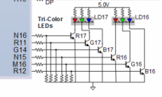
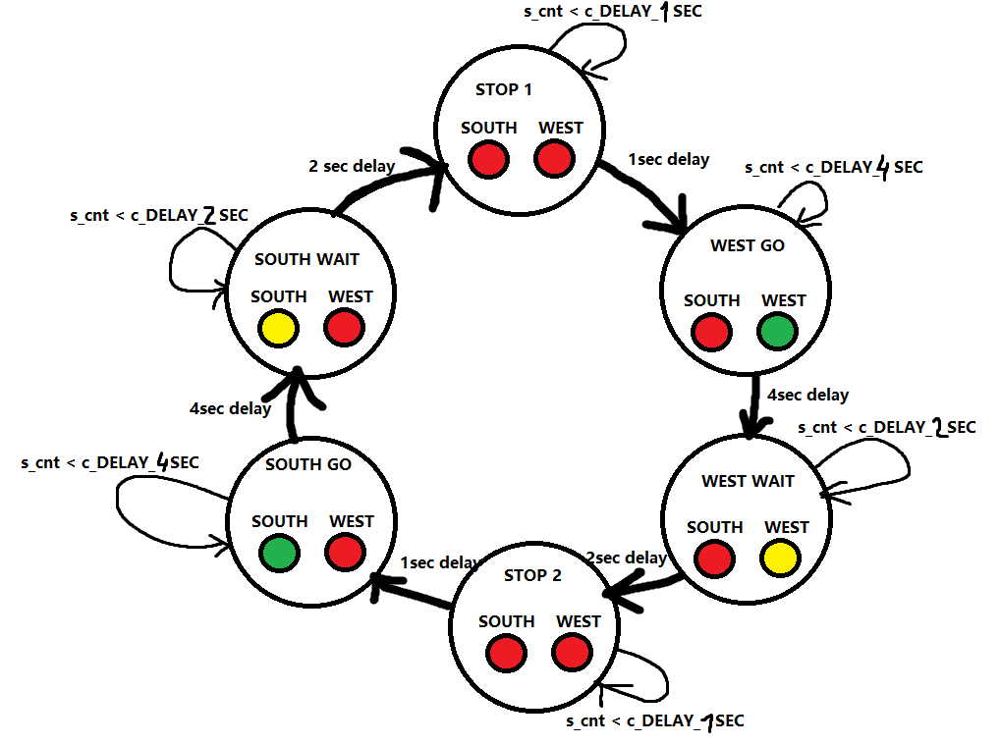
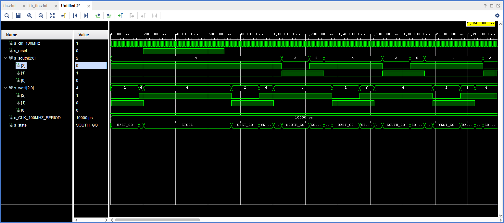
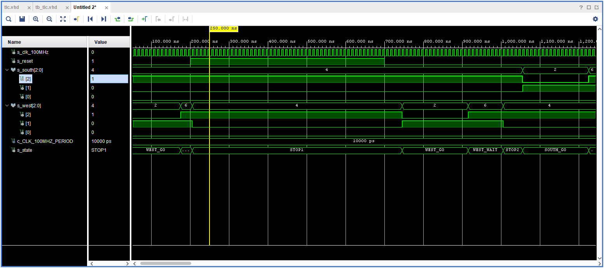
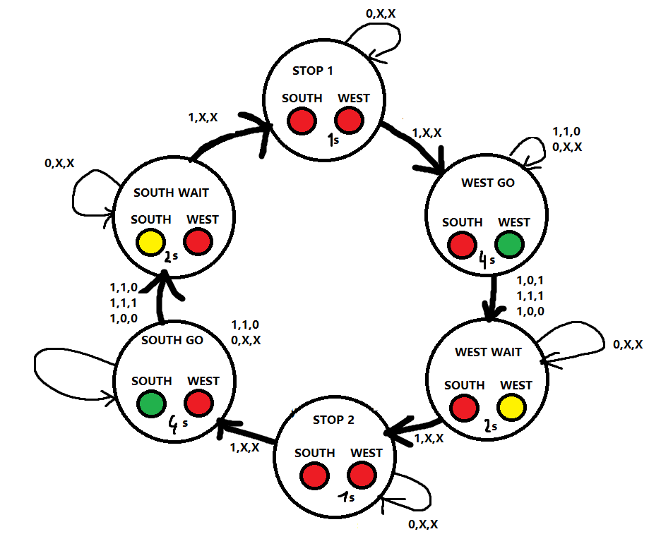

odkaz na repositar [DE1](https://github.com/MartinSomsak00/DE1) 


# Task 1

## Completed state table

| **Input P** | `0` | `0` | `1` | `1` | `0` | `1` | `0` | `1` | `1` | `1` | `1` | `0` | `0` | `1` | `1` | `1` |
| :-- | :-: | :-: | :-: | :-: | :-: | :-: | :-: | :-: | :-: | :-: | :-: | :-: | :-: | :-: | :-: | :-: |
| **Clock** |  |  |  |  |  |  |  |  |  |  |  |  |  |  |  |  |
| **State** | A | A | B | C | C | D | A | B | C | D | B | B | B | C | D | B |
| **Output R** | `0` | `0` | `0` | `0` | `0` | `1` | `0` | `0` | `0` | `1` | `0` | `0` | `0` | `0` | `1` | `0` |

## connection of RGB LEDs on Nexys A7 board



## completed table with color settings

| **RGB LED** | **Artix-7 pin names** | **Red** | **Yellow** | **Green** |
| :-: | :-: | :-: | :-: | :-: |
| LD16 | N15, M16, R12 | `1,0,0` | `1,1,0` | `0,1,0` |
| LD17 | N16, R11, G14 | `1,0,0` | `1,1,0` | `0,1,0` |

# Task 2 

## State diagram




## Listing of VHDL code of sequential process p_traffic_fsm

```vhdl
 p_traffic_fsm : process(clk)
    begin
        if rising_edge(clk) then
            if (reset = '1') then       
                s_state <= STOP1 ;      
                s_cnt   <= c_ZERO;      

            elsif (s_en = '1') then
                
                case s_state is

                    
                    when STOP1 =>
                        
                        if (s_cnt < c_DELAY_1SEC) then
                            s_cnt <= s_cnt + 1;
                        else
                            
                            s_state <= WEST_GO;
                           
                            s_cnt   <= c_ZERO;
                        end if;

                    when WEST_GO =>
                    if (s_cnt < c_DELAY_4SEC) then
                            s_cnt <= s_cnt + 1;
                        else
                            s_state <= WEST_WAIT;
                            s_cnt   <= c_ZERO;
                        end if;
                        
                    when WEST_WAIT =>
                        if (s_cnt < c_DELAY_2SEC) then
                            s_cnt <= s_cnt + 1;
                        else
                            s_state <= STOP2;
                            s_cnt   <= c_ZERO;
                        end if;
                        
                    when STOP2 =>
                        if (s_cnt < c_DELAY_1SEC) then
                            s_cnt <= s_cnt + 1;
                        else
                            s_state <= SOUTH_GO;
                            s_cnt   <= c_ZERO;
                        end if;
                        
                    when SOUTH_GO =>
                        if (s_cnt < c_DELAY_4SEC) then
                            s_cnt <= s_cnt + 1;
                        else
                            s_state <= SOUTH_WAIT;
                            s_cnt   <= c_ZERO;
                        end if;
                        
                    when SOUTH_WAIT =>
                        if (s_cnt < c_DELAY_2SEC) then
                            s_cnt <= s_cnt + 1;
                        else
                            s_state <= STOP1;
                            s_cnt   <= c_ZERO;
                        end if;
                   

                     
                    when others =>
                        s_state <= STOP1;

                end case;
            end if; 
        end if; 
    end process p_traffic_fsm;
```

## Listing of VHDL code of combinatorial process p_output_fsm

```vhdl
p_output_fsm : process(s_state)
    begin
        case s_state is
            when STOP1 =>
                south_o <= "100";   -- Red (RGB = 100)
                west_o  <= "100";   -- Red (RGB = 100)
            when WEST_GO =>
                south_o <= "100";   -- Red (RGB = 100)
                west_o  <= "010";   -- Red (RGB = 010)
                
            when WEST_WAIT =>
                south_o <= "100";   -- Red (RGB = 100)
                west_o  <= "110";   -- Red (RGB = 011)
            
            when STOP2 =>
                south_o <= "100";   -- Red (RGB = 100)
                west_o  <= "100";   -- Red (RGB = 100)
                
            when SOUTH_GO =>
                south_o <= "010";   -- Red (RGB = 010)
                west_o  <= "100";   -- Red (RGB = 100)
                
            when SOUTH_WAIT =>
                south_o <= "110";   -- Red (RGB = 011)
                west_o  <= "100";   -- Red (RGB = 100) 

            when others =>
                south_o <= "100";   -- Red
                west_o  <= "100";   -- Red
        end case;
    end process p_output_fsm;
```

## Screenshots of the simulation



### Zoomed 
 


# Task 3 

## State table

| **Current state** | **Direction South** | **Direction West** | **Delay** | **Input (counter_en, sensor_west, sensor_south)** |
| :-- | :-: | :-: | :-: | :-: |
| `STOP1`      | red    | red | 1 sec | n/c |
| `WEST_GO`    | red    | green | 4 sec | 1,1,0 or 0, X, X goto WEST_GO else goto WEST_WAIT |
| `WEST_WAIT`  | red    | yellow | 2 sec | n/c |
| `STOP2`      | red    | red | 1 sec | n/c |
| `SOUTH_GO`   | green  | red | 4 sec | 1,0,1 or 0, X, X goto SOUTH_GO else goto SOUTH_WAIT |
| `SOUTH_WAIT` | yellow | red | 2 sec | n/c |

## State diagram 

